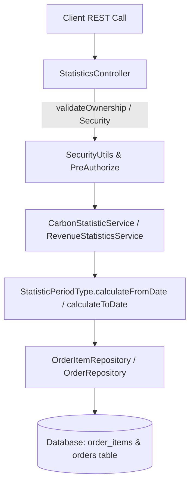

# Carbon Index & Revenue Statistics API Implementation Plan

This document outlines the architecture and execution plan for the Statistics API in the `be/statistics` module.

---

## 1. Feature Overview & Domain Context

- **Carbon Index Statistics**: Measures environmental carbon footprint impact (`line_carbon_footprint`) for completed orders across time periods (**DAILY**, **MONTHLY**, or **YEARLY**).
- **Revenue Statistics**: Calculates total sales revenue (`total_amount`) for completed orders across time periods.

### Authorization & Ownership Controls:
- **Carbon Index Endpoint (`GET /api/v1/statistics/product/carbon-index`)**: `@PreAuthorize("hasRole('USER')")` with `SecurityUtils.validateOwnership(userId, jwt)` check.
- **Revenue Endpoint (`GET /api/v1/statistics/product/revenue`)**: `@PreAuthorize("hasRole('ADMIN')")` restricted to users with `ROLE_ADMIN`.

---

## 2. Endpoint Contracts

### Carbon Index Endpoint
- **HTTP Method:** `GET`
- **Path:** `/api/v1/statistics/product/carbon-index` (and alias `/v1/statistics/product/carbon-index`)
- **Authorization:** `ROLE_USER` + Ownership Validation
- **Query Parameters:**
  - `periodType` (Enum: `DAILY`, `MONTHLY`, `YEARLY`; Default: `DAILY`)
  - `date` (ISO Date `YYYY-MM-DD`; Default: Current Date `LocalDate.now()`)
- **Response Format:** `ApiResponse<StatisticResponse<Double>>`

### Revenue Endpoint
- **HTTP Method:** `GET`
- **Path:** `/api/v1/statistics/product/revenue` (and alias `/v1/statistics/product/revenue`)
- **Authorization:** `ROLE_ADMIN`
- **Query Parameters:**
  - `periodType` (Enum: `DAILY`, `MONTHLY`, `YEARLY`; Default: `DAILY`)
  - `date` (ISO Date `YYYY-MM-DD`; Default: Current Date `LocalDate.now()`)
- **Response Format:** `ApiResponse<StatisticResponse<BigDecimal>>`

---

## 3. Architecture & Domain Design

### Component Details:
1. **Unified Controller (`StatisticsController`)**: Consolidates endpoints for revenue and carbon statistics. Applies `@PreAuthorize("hasRole('ADMIN')")` for revenue and `@PreAuthorize("hasRole('USER')")` + `validateOwnership` for carbon statistics.
2. **Generic DTO (`StatisticResponse<T>`)**: Unified generic response container (`periodType`, `date`, `fromDate`, `toDate`, `total`).
3. **Unified Enum (`StatisticPeriodType`)**: Enums (`DAILY`, `MONTHLY`, `YEARLY`) with helper methods `calculateFromDate(LocalDate)` and `calculateToDate(LocalDate)`.
4. **Repository Queries**:
   - `OrderItemRepository.calculateTotalCarbonFootprint(userId, ...)`: Sums `line_carbon_footprint` for `COMPLETED` orders of a specific user.
   - `OrderRepository.calculateTotalRevenue(...)`: Sums `total_amount` for `COMPLETED` orders.

---

## 4. Verification & Testing Strategy
- Unit tests (`CarbonStatisticServiceTest`, `RevenueStatisticsServiceTest`) testing date range calculations.
- Integration tests (`StatisticsIT.groovy`) in `be/flix-integration-test` covering:
  - Ownership validation and user role authorization (`validateOwnership` & `ROLE_USER`).
  - Admin role authorization for revenue statistics (`ROLE_ADMIN`).
  - Access denial (403 Forbidden) for non-admin users attempting to query revenue statistics.
  - Access denial (401 Unauthorized / 403 Forbidden) for unauthenticated requests.
