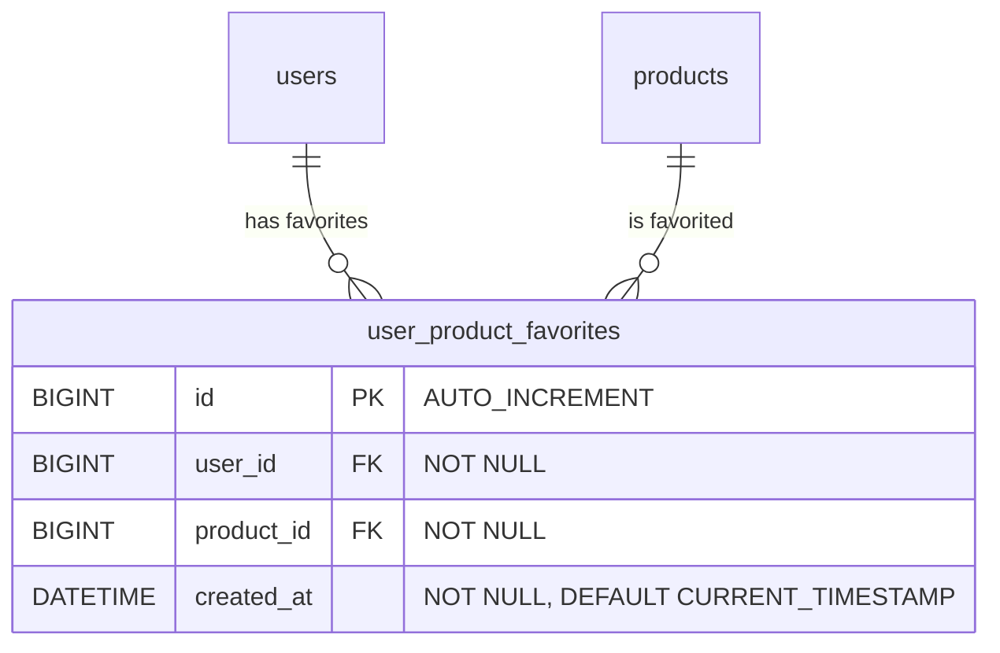

# User Product Favorite (Wishlist) Backend Implementation Plan

This document details the complete backend implementation plan for the **User Product Favorite (Wishlist)** feature in the `be/catalog` module of the Flix Platform.

---

## 1. Feature Architecture & Domain Map

The Favorite feature provides RESTful backend endpoints allowing authenticated users to toggle favorite status for products, retrieve their paginated list of favorited products, and check single or batch favorite statuses.

### Database Schema (Flyway Migration: `V10__Create_User_Product_Favorite.sql`)

- **Unique Constraint**: `(user_id, product_id)` ensures a user cannot favorite the same product multiple times.
- **Foreign Keys**: Cascading deletion on user or product deletion.
- **Indexes**: Indexed on `user_id` and `product_id` for fast query performance.

---

## 2. API Contract & Endpoints

Base Path: `/v1/catalog/favorites`

| Method | Endpoint | Description | Security |
| :--- | :--- | :--- | :--- |
| `POST` | `/v1/catalog/favorites/{productId}/toggle` | Toggle favorite status (Add if not favorited, Remove if favorited) | Auth Required |
| `GET` | `/v1/catalog/favorites` | Get paginated list of user's favorite products | Auth Required |
| `GET` | `/v1/catalog/favorites/check/{productId}` | Check if product is favorited by current user | Auth Required |
| `POST` | `/v1/catalog/favorites/check-batch` | Batch check favorite status for list of product IDs | Auth Required |

---

## 3. Backend Implementation Checklist

| Scope | File Path | Status | Description |
| :--- | :--- | :--- | :--- |
| **Database** | [`be/app/src/main/resources/db/migration/V10__Create_User_Product_Favorite.sql`](file:///E:/intelljProject/flix-plaftform/be/app/src/main/resources/db/migration/V10__Create_User_Product_Favorite.sql) | Completed | Flyway schema migration |
| **JPA Entity** | [`be/catalog/src/main/java/com/flix/catalog/entity/UserFavoriteEntity.java`](file:///E:/intelljProject/flix-plaftform/be/catalog/src/main/java/com/flix/catalog/entity/UserFavoriteEntity.java) | Completed | Entity mapping table `user_product_favorites` |
| **Repository** | [`be/catalog/src/main/java/com/flix/catalog/dao/UserFavoriteRepository.java`](file:///E:/intelljProject/flix-plaftform/be/catalog/src/main/java/com/flix/catalog/dao/UserFavoriteRepository.java) | Completed | Spring Data JPA query methods |
| **DTO** | [`be/catalog/src/main/java/com/flix/catalog/common/dto/FavoriteToggleResponse.java`](file:///E:/intelljProject/flix-plaftform/be/catalog/src/main/java/com/flix/catalog/common/dto/FavoriteToggleResponse.java) | Completed | DTO for toggle status response |
| **DTO** | [`be/catalog/src/main/java/com/flix/catalog/common/dto/FavoriteCheckResponse.java`](file:///E:/intelljProject/flix-plaftform/be/catalog/src/main/java/com/flix/catalog/common/dto/FavoriteCheckResponse.java) | Completed | DTO for single check response |
| **DTO** | [`be/catalog/src/main/java/com/flix/catalog/common/dto/BatchFavoriteCheckRequest.java`](file:///E:/intelljProject/flix-plaftform/be/catalog/src/main/java/com/flix/catalog/common/dto/BatchFavoriteCheckRequest.java) | Completed | DTO request payload for batch check |
| **Service** | [`be/catalog/src/main/java/com/flix/catalog/favorite/service/FavoriteService.java`](file:///E:/intelljProject/flix-plaftform/be/catalog/src/main/java/com/flix/catalog/favorite/service/FavoriteService.java) | Completed | Core business logic layer |
| **Controller** | [`be/catalog/src/main/java/com/flix/catalog/api/controller/FavoriteController.java`](file:///E:/intelljProject/flix-plaftform/be/catalog/src/main/java/com/flix/catalog/api/controller/FavoriteController.java) | Completed | REST API Endpoints with Spring Security |
