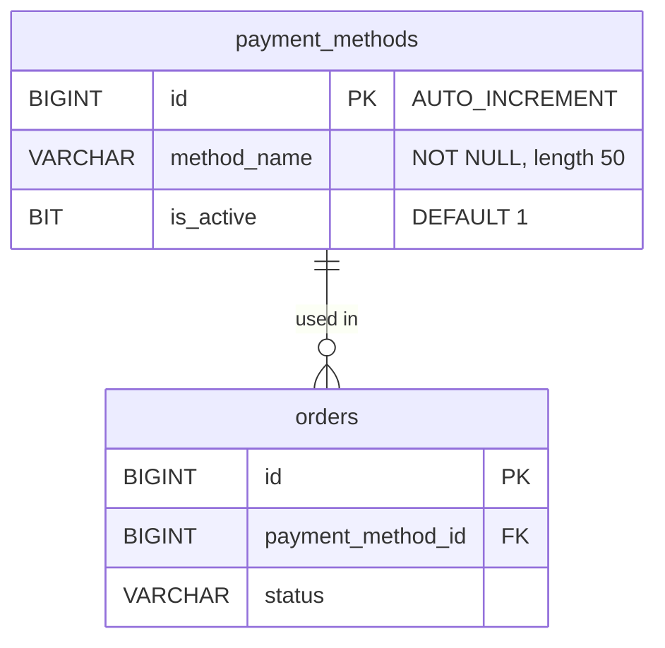

# Payment Method Management Backend Implementation Plan

This document details the complete backend implementation plan for the **Payment Method Management** feature in the `be/catalog` module of the Flix Platform.

---

## 1. Feature Architecture & Domain Map

The Payment Method feature provides RESTful backend endpoints allowing customers to fetch active payment methods during checkout, and admins to create, update, list, toggle status, and delete payment methods.

### Database Schema (from `V5__create_schema_based_on_cdm4.sql` & `V15__seed_payment_methods.sql`)

```sql
CREATE TABLE payment_methods
(
    id          BIGINT AUTO_INCREMENT NOT NULL,
    method_name VARCHAR(50)           NOT NULL,
    is_active   BIT(1) DEFAULT b'1'   NULL,
    CONSTRAINT pk_payment_methods PRIMARY KEY (id)
);
```



---

## 2. API Contract & Endpoints

Base Path: `/v1/catalog/payment-methods` (and alias `/api/v1/catalog/payment-methods`)

| Method | Endpoint | Description | Security / Authorization |
| :--- | :--- | :--- | :--- |
| `GET` | `/v1/catalog/payment-methods` | Get list of active payment methods for customer checkout | Public / Authenticated |
| `GET` | `/v1/catalog/payment-methods/admin` | Get all payment methods (active & inactive) | Admin (`hasRole('ADMIN')`) |
| `GET` | `/v1/catalog/payment-methods/{id}` | Get details of a specific payment method | Admin / Authenticated |
| `POST` | `/v1/catalog/payment-methods` | Create a new payment method | Admin (`hasRole('ADMIN')`) |
| `PUT` | `/v1/catalog/payment-methods/{id}` | Update payment method details | Admin (`hasRole('ADMIN')`) |
| `PATCH` | `/v1/catalog/payment-methods/{id}/status` | Toggle payment method active status | Admin (`hasRole('ADMIN')`) |
| `DELETE` | `/v1/catalog/payment-methods/{id}` | Delete or deactivate a payment method | Admin (`hasRole('ADMIN')`) |

---

## 3. Core Business Logic & Rules

1. **Active Filtering for Customers**: Public/Checkout users can only query payment methods where `is_active = true`.
2. **Admin Management**: Admins have full CRUD capability and can enable/disable payment methods.
3. **Data Integrity & Protection**:
   - Duplicate method names should be prevented or handled gracefully.
   - Deleting a payment method in use by orders should prevent hard deletion and perform a safe soft deactivation (`is_active = false`) or throw a validated business exception.
4. **Integration with Checkout Flow**:
   - `OrderService.java` relies on `PaymentMethodRepository` to resolve selected payment methods.

---

## 4. Component Structure & File Map

| Component | Target File Location | Description |
| :--- | :--- | :--- |
| **JPA Entity** | `be/catalog/src/main/java/com/flix/catalog/entity/PaymentMethodEntity.java` | Existing entity mapped to table `payment_methods` |
| **Repository** | `be/catalog/src/main/java/com/flix/catalog/dao/PaymentMethodRepository.java` | Data access layer extending `JpaRepository` |
| **DTOs** | `be/catalog/src/main/java/com/flix/catalog/common/dto/PaymentMethodRequest.java`<br>`be/catalog/src/main/java/com/flix/catalog/common/dto/PaymentMethodResponse.java` | Payload validation & Response DTOs |
| **Service** | `be/catalog/src/main/java/com/flix/catalog/paymentmethod/service/PaymentMethodService.java` | Core business logic for payment method CRUD and status toggle |
| **Controller** | `be/catalog/src/main/java/com/flix/catalog/api/controller/PaymentMethodController.java` | REST Controller with Spring Security rules |
| **Integration Test** | `be/flix-integration-test/src/test/groovy/com/flix/flixintegrationtest/catalog/api/paymentmethod/PaymentMethodIT.groovy` | E2E Integration test covering customer and admin flows |
