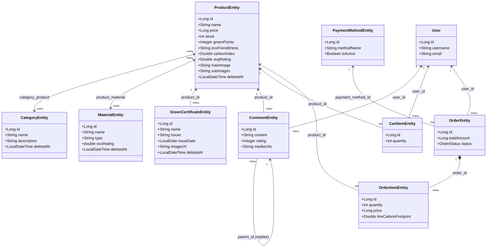

# Product Feature Implementation & Refactoring Plan

This document outlines the step-by-step plan for refactoring existing API endpoints and implementing the remaining components of the **Product Feature** in the `be/catalog` module of the Flix Platform.

The scope of this plan has been updated to follow a **Unified API and Service Pattern** for resource creation and updates:
* **Single createOrUpdate API Handler**: A single HTTP handler mapping both create and update operations under the same method.
* **Optional Path Variable for ID**: The ID is optional and passed strictly via the URL path variable (e.g., `POST /v1/catalog/{resource}` for creation, and `POST /v1/catalog/{resource}/{id}` for updates).
* **ID-Free DTOs**: Request payloads (DTOs) contain no `id` fields.

---

## 1. Domain Map & Schema Alignment

Below is the database schema mapping from [V5__create_schema_based_on_cdm4.sql](file:///E:/intelljProject/flix-plaftform/be/app/src/main/resources/db/migration/V5__create_schema_based_on_cdm4.sql) and [V6__sofl_delete_catalog_domain.sql](file:///E:/intelljProject/flix-plaftform/be/app/src/main/resources/db/migration/V6__sofl_delete_catalog_domain.sql).



---

## 2. Refactoring API Handlers (Unified createOrUpdate Endpoint)

For **Product, Material, GreenCert, Category, and Comment**, we will refactor creation and updates to follow a unified controller endpoint pattern:
* **HTTP Mapping**: `@PostMapping(value = {"", "/{id}"})`
* **Path Variable**: `@PathVariable(value = "id", required = false) Long id`
* **Flow**:
  * If `id == null`, a new resource is created.
  * If `id != null`, the existing resource with the matching ID is updated.

### 2.1 Refactoring DTOs (Remove ID Field)
Modify the following DTO records to remove the `Long id` field:
1. [CategoryEntityRequest](file:///E:/intelljProject/flix-plaftform/be/catalog/src/main/java/com/flix/catalog/common/dto/CategoryEntityRequest.java)
2. [ProductEntityRequest](file:///E:/intelljProject/flix-plaftform/be/catalog/src/main/java/com/flix/catalog/common/dto/ProductEntityRequest.java)
3. [MaterialEntityRequest](file:///E:/intelljProject/flix-plaftform/be/catalog/src/main/java/com/flix/catalog/common/dto/MaterialEntityRequest.java)
4. [GreenCertificateEntityRequest](file:///E:/intelljProject/flix-plaftform/be/catalog/src/main/java/com/flix/catalog/common/dto/GreenCertificateEntityRequest.java)
5. [CommentEntityRequest](file:///E:/intelljProject/flix-plaftform/be/catalog/src/main/java/com/flix/catalog/common/dto/CommentEntityRequest.java)

### 2.2 Refactoring Service Interfaces (Receive ID from Method Parameter)
Update existing services to use the signature `createOrUpdate[Resource](Long id, [Resource]Request request)`:

* **CategoryService**:
  ```java
  public CategoryEntityResponse createOrUpdateCategory(Long id, CategoryEntityRequest request) {
      CategoryEntity categoryEntity;
      if (id != null) {
          categoryEntity = categoryRepository.findById(id)
                  .orElseThrow(() -> new BusinessException(ErrorCode.CATEGORY_NOT_FOUND));
          log.info("Updated category with ID: {}", id);
      } else {
          categoryEntity = new CategoryEntity();
          log.info("Created category with name: {}", request.name());
      }
      request.toEntity(categoryEntity);
      return CategoryEntityResponse.from(categoryRepository.save(categoryEntity));
  }
  ```
* **ProductService**:
  ```java
  public ProductEntityResponse createOrUpdateProduct(Long id, ProductEntityRequest request) {
      var categories = resolveCategories(request.categoryIds());
      var materials = resolveMaterials(request.materialIds());
      ProductEntity productEntity;
      if (id != null) {
          productEntity = productRepository.findById(id)
                  .orElseThrow(() -> new BusinessException(ErrorCode.PRODUCT_NOT_FOUND));
          log.info("Updated product with ID: {}", id);
      } else {
          productEntity = new ProductEntity();
          log.info("Created product with name: {}", request.name());
      }
      request.toEntity(productEntity, categories, materials);
      return ProductEntityResponse.from(productRepository.save(productEntity));
  }
  ```
* **MaterialService**:
  ```java
  public MaterialEntityResponse createOrUpdateMaterial(Long id, MaterialEntityRequest request) {
      MaterialEntity materialEntity;
      if (id != null) {
          materialEntity = materialRepository.findById(id)
                  .orElseThrow(() -> new BusinessException(ErrorCode.MATERIAL_NOT_FOUND));
          log.info("Updated material with ID: {}", id);
      } else {
          materialEntity = new MaterialEntity();
          log.info("Created material with name: {}", request.name());
      }
      request.toEntity(materialEntity);
      return MaterialEntityResponse.from(materialRepository.save(materialEntity));
  }
  ```
* **GreenCertificateService**:
  ```java
  public GreenCertificateEntityResponse createOrUpdateGreenCertificate(Long id, GreenCertificateEntityRequest request) {
      var productEntity = productRepository.findById(request.productId())
              .orElseThrow(() -> new BusinessException(ErrorCode.PRODUCT_NOT_FOUND));
      GreenCertificateEntity certificateEntity;
      if (id != null) {
          certificateEntity = greenCertificateRepository.findById(id)
                  .orElseThrow(() -> new BusinessException(ErrorCode.CERTIFICATE_NOT_FOUND));
          log.info("Updated green certificate with ID: {}", id);
      } else {
          certificateEntity = new GreenCertificateEntity();
          log.info("Created green certificate with name: {}", request.name());
      }
      request.toEntity(certificateEntity, productEntity);
      return GreenCertificateEntityResponse.from(greenCertificateRepository.save(certificateEntity));
  }
  ```
* **CommentService**:
  ```java
  public CommentEntityResponse createOrUpdateComment(Long id, CommentEntityRequest request) {
      var userEntity = userRepository.findById(request.userId())
              .orElseThrow(() -> new BusinessException(ErrorCode.USER_NOT_FOUND));
      var productEntity = productRepository.findById(request.productId())
              .orElseThrow(() -> new BusinessException(ErrorCode.PRODUCT_NOT_FOUND));
      CommentEntity parent = request.parentId() != null ? 
              commentRepository.findById(request.parentId()).orElseThrow(() -> new BusinessException(ErrorCode.PARENT_COMMENT_NOT_FOUND)) : null;

      CommentEntity commentEntity;
      if (id != null) {
          commentEntity = commentRepository.findById(id)
                  .orElseThrow(() -> new BusinessException(ErrorCode.COMMENT_NOT_FOUND));
          log.info("Updated comment with ID: {}", id);
      } else {
          commentEntity = new CommentEntity();
          log.info("Created comment for product ID: {}", request.productId());
      }
      request.toEntity(commentEntity, userEntity, productEntity, parent);
      return CommentEntityResponse.from(commentRepository.save(commentEntity));
  }
  ```

### 2.3 Refactoring Controllers (Unified Handler Method)
Expose a single handler method for both creation and update, checking the presence of the optional path variable:

* **CategoryController**:
  ```java
  @PostMapping(value = {"", "/{id}"})
  @ResponseStatus(HttpStatus.OK)
  @PreAuthorize("hasRole('ADMIN')")
  public ApiResponse<CategoryEntityResponse> createOrUpdateCategory(
          @PathVariable(value = "id", required = false) Long id,
          @Valid @RequestBody CategoryEntityRequest request) {
      return ApiResponse.success(categoryService.createOrUpdateCategory(id, request));
  }
  ```
* **ProductController**:
  ```java
  @PostMapping(value = {"", "/{id}"})
  @ResponseStatus(HttpStatus.OK)
  @PreAuthorize("hasRole('ADMIN')")
  public ApiResponse<ProductEntityResponse> createOrUpdateProduct(
          @PathVariable(value = "id", required = false) Long id,
          @Valid @RequestBody ProductEntityRequest request) {
      return ApiResponse.success(productService.createOrUpdateProduct(id, request));
  }
  ```
* **MaterialController**:
  ```java
  @PostMapping(value = {"", "/{id}"})
  @ResponseStatus(HttpStatus.OK)
  @PreAuthorize("hasRole('ADMIN')")
  public ApiResponse<MaterialEntityResponse> createOrUpdateMaterial(
          @PathVariable(value = "id", required = false) Long id,
          @Valid @RequestBody MaterialEntityRequest request) {
      return ApiResponse.success(materialService.createOrUpdateMaterial(id, request));
  }
  ```
* **GreenCertificateController**:
  ```java
  @PostMapping(value = {"", "/{id}"})
  @ResponseStatus(HttpStatus.OK)
  @PreAuthorize("hasRole('ADMIN')")
  public ApiResponse<GreenCertificateEntityResponse> createOrUpdateGreenCertificate(
          @PathVariable(value = "id", required = false) Long id,
          @Valid @RequestBody GreenCertificateEntityRequest request) {
      return ApiResponse.success(greenCertificateService.createOrUpdateGreenCertificate(id, request));
  }
  ```
* **CommentController** (To be created in Phase 1):
  ```java
  @PostMapping(value = {"", "/{id}"})
  @ResponseStatus(HttpStatus.OK)
  public ApiResponse<CommentEntityResponse> createOrUpdateComment(
          @PathVariable(value = "id", required = false) Long id,
          @Valid @RequestBody CommentEntityRequest request) {
      return ApiResponse.success(commentService.createOrUpdateComment(id, request));
  }
  ```

---

## 3. Step-by-Step Implementation Steps

### Phase 1: Complete & Refactor Existing Features
1. **DTO Refactoring**: Strip the `id` field from all 5 requested request records.
2. **Service Refactoring**: Update services to accept ID as an explicit method parameter, performing `id != null` checks to handle updates.
3. **Controller Refactoring**: Implement `@PostMapping(value = {"", "/{id}"})` with `@PathVariable(value = "id", required = false)` for the 5 domain controllers.
4. **Comment Controller**: Create `CommentController` implementing this pattern.

### Phase 2: Implement CartItem Feature
1. **JPA Entity**: Create `CartItemEntity` in `com.flix.catalog.entity` mapped to `cart_items` table.
2. **Repository**: Create `CartItemRepository` in `com.flix.catalog.dao`.
3. **DTOs**: Create `CartItemRequest` (no `id` field) and `CartItemResponse` in `com.flix.catalog.common.dto`.
4. **Service**: Create `CartItemService` in `com.flix.catalog.cart.service` package.
5. **Controller**: Create `CartItemController` matching the pattern:
   - `POST /v1/catalog/cart` / `POST /v1/catalog/cart/{id}` (Add new item, or update quantity of specific cart item ID using optional path variable)
   - `GET /v1/catalog/cart` (Get cart items for current user)
   - `DELETE /v1/catalog/cart/{id}` (Remove item)

### Phase 3: Implement PaymentMethod & Order Features
1. **PaymentMethod**:
   - Create `PaymentMethodEntity` and `PaymentMethodRepository`.
2. **OrderStatus**:
   - Create `OrderStatus` enum (`PENDING`, `COMPLETED`, `CANCELLED`).
3. **Order & OrderItem Entities**:
   - Create `OrderEntity` and `OrderItemEntity`.
4. **Repositories**:
   - Create `OrderRepository` and `OrderItemRepository`.
5. **DTOs**:
   - Create `OrderRequest`, `OrderResponse`, `OrderItemRequest`, and `OrderItemResponse` (without `id` in request objects).
6. **Service & Controller**:
   - Create `OrderService` and `OrderController`. Endpoints:
     - `POST /v1/catalog/orders` / `POST /v1/catalog/orders/{id}` (Place order, or update order status via optional path variable ID)
     - `GET /v1/catalog/orders` (List user orders)
     - `GET /v1/catalog/orders/{id}` (Get order detail)

---

## 4. Class & DTO Details (New Features)

*(Refer to detailed class definitions in Section 4 of the repository version of this file.)*

---

## 5. Testing Strategy
Update existing integration test templates and add new tests:
* Verify that posting to `/v1/catalog/{resource}` with no ID in URI successfully creates a resource.
* Verify that posting to `/v1/catalog/{resource}/{id}` with a valid ID in URI successfully updates the resource.
* Verify that ID values provided in request bodies are completely rejected by validation/ignored.
