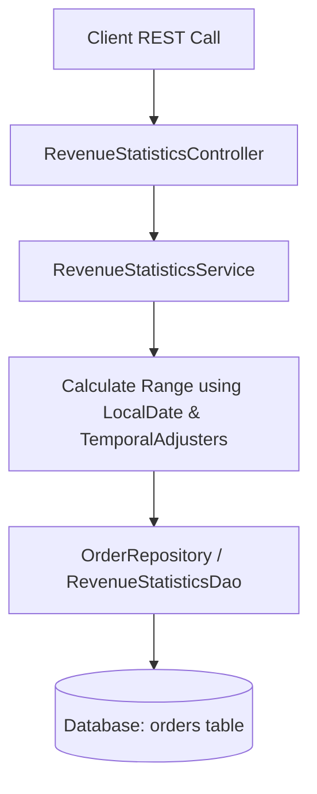

# Revenue Statistics API Implementation Plan

This document outlines the architecture and execution plan for refactoring the Revenue Statistics API in the `be/statistics` module.

---

## 1. Feature Overview & Requirements

The Revenue Statistics API calculates total revenue filtered dynamically by date ranges (**DAILY**, **MONTHLY**, or **YEARLY**). 
To optimize database performance and utilize database indexes on timestamp columns, the implementation replaces SQL date-part extraction functions (`YEAR()`, `MONTH()`, `DAY()`) with range comparison (`createdAt >= :fromDate AND createdAt <= :toDate`).

### Endpoint Contract
- **HTTP Method:** `GET`
- **Path:** `/api/v1/statistics/product/revenue` (also mapping `/v1/statistics/product/revenue`)
- **Query Parameters:**
  - `periodType` (Enum: `DAILY`, `MONTHLY`, `YEARLY`; Default: `DAILY`)
  - `date` (ISO Date `YYYY-MM-DD`; Default: Current Date `LocalDate.now()`)
- **Response Format:** `ApiResponse<RevenueStatisticResponse>`

---

## 2. Architecture & Domain Design

### Component Details:
1. **Enum (`RevenuePeriodType`)**: `DAILY`, `MONTHLY`, `YEARLY`.
2. **Entity (`OrderEntity`)**: Enhanced with `createdAt` (`LocalDateTime`) mapped to `created_at` column.
3. **DB Migration (`V11__Add_Created_At_To_Orders.sql`)**: Add `created_at` column to `orders` table.
4. **Repository (`OrderRepository` / `RevenueStatisticsDao`)**: JPQL query calculating `SUM(totalAmount)` within range `[fromDate, toDate]` for completed orders.
5. **Service (`RevenueStatisticsService`)**: Computes exact `fromDate` (00:00:00) and `toDate` (23:59:59.999999999) based on period type and date.
6. **DTO (`RevenueStatisticResponse`)**: Structured payload containing request parameters, calculated range, and total revenue.
7. **Controller (`RevenueStatisticsController`)**: Exposes REST endpoint `@GetMapping("/product/revenue")`.

---

## 3. Date Range Calculation Logic

| Period Type | `fromDate` Calculation | `toDate` Calculation |
| :--- | :--- | :--- |
| `DAILY` | `date.atStartOfDay()` | `date.atTime(LocalTime.MAX)` |
| `MONTHLY` | `date.with(TemporalAdjusters.firstDayOfMonth()).atStartOfDay()` | `date.with(TemporalAdjusters.lastDayOfMonth()).atTime(LocalTime.MAX)` |
| `YEARLY` | `date.with(TemporalAdjusters.firstDayOfYear()).atStartOfDay()` | `date.with(TemporalAdjusters.lastDayOfYear()).atTime(LocalTime.MAX)` |

---

## 4. Verification & Testing Strategy
- Unit tests for date range calculations across leap years, month boundaries, and year boundaries.
- Controller unit tests validating query parameters, defaults, and API response wrapper.
