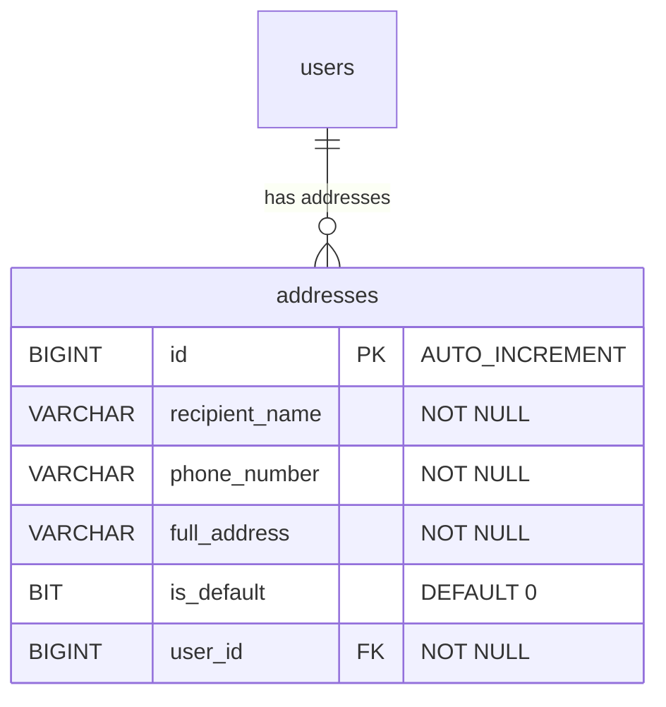

# User Address Management Backend Implementation Plan

This document details the complete backend implementation plan for the **User Address Management** feature in the `be/identity` module of the Flix Platform.

---

## 1. Feature Architecture & Domain Map

The Address feature provides RESTful backend endpoints allowing authenticated users to create, update, delete, list, and set default shipping/contact addresses.

### Database Schema (from `V5__create_schema_based_on_cdm4.sql`)

```sql
CREATE TABLE addresses
(
    id             BIGINT AUTO_INCREMENT NOT NULL,
    recipient_name VARCHAR(100)          NOT NULL,
    phone_number   VARCHAR(20)           NOT NULL,
    full_address   VARCHAR(255)          NOT NULL,
    is_default     BIT(1) DEFAULT b'0'   NULL,
    user_id        BIGINT                NOT NULL,
    CONSTRAINT pk_addresses PRIMARY KEY (id),
    CONSTRAINT fk_addresses_on_user FOREIGN KEY (user_id) REFERENCES users (id)
);
```



---

## 2. API Contract & Endpoints

Base Path: `/v1/identity/addresses`

| Method | Endpoint | Description | Security |
| :--- | :--- | :--- | :--- |
| `POST` | `/v1/identity/addresses` | Create a new user address | Auth Required |
| `GET` | `/v1/identity/addresses` | Get list of user addresses | Auth Required |
| `GET` | `/v1/identity/addresses/{id}` | Get address details by ID | Auth Required |
| `PUT` | `/v1/identity/addresses/{id}` | Update existing address | Auth Required |
| `DELETE` | `/v1/identity/addresses/{id}` | Delete address by ID | Auth Required |
| `PATCH` | `/v1/identity/addresses/{id}/default` | Set an address as default | Auth Required |

---

## 3. Core Business Logic & Rules
1. **Entity Name Constraint**: Must use `AddressesEntity` mapped to table `addresses`.
2. **Default Address Handling**: 
   - A user can have at most one address marked as `is_default = true`.
   - If a new address is created/updated with `is_default = true` or set as default via API, any previously existing default address for that user must be set to `is_default = false`.
   - If an address is the user's first address, automatically mark it as default.
3. **Data Integrity & Security**:
   - All queries and mutations must be scoped by `userId` extracted from the authenticated JWT token to prevent unauthorized access to another user's address data.

---

## 4. Component Structure & File Map

| Component | Target File Location | Description |
| :--- | :--- | :--- |
| **JPA Entity** | `be/identity/src/main/java/com/flix/identity/entity/AddressesEntity.java` | Mapping table `addresses` (name: `AddressesEntity`) |
| **Repository** | `be/identity/src/main/java/com/flix/identity/dao/AddressesRepository.java` | Data access layer using Spring Data JPA |
| **DTOs** | `be/identity/src/main/java/com/flix/identity/common/dto/AddressRequest.java`<br>`be/identity/src/main/java/com/flix/identity/common/dto/AddressResponse.java` | Request payload validation & Response DTOs |
| **Service** | `be/identity/src/main/java/com/flix/identity/address/service/AddressService.java` | Business logic, validation, default address switching |
| **Controller** | `be/identity/src/main/java/com/flix/identity/api/AddressController.java` | REST Controller with Spring Security integration |
| **Integration Test** | `be/flix-integration-test/src/test/groovy/com/flix/flixintegrationtest/identity/api/address/AddressIT.groovy` | Single E2E flow integration test covering complete lifecycle (Create -> List -> Get -> Update -> Set Default -> Delete) |
