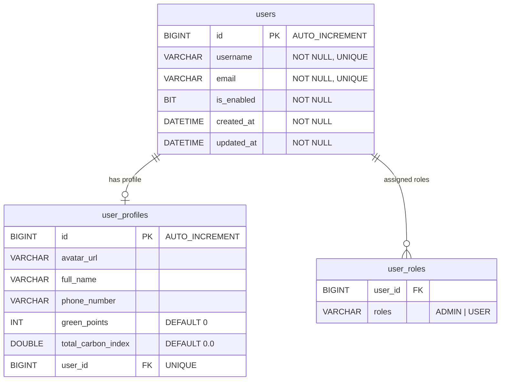

# User Management Feature Integration & Implementation Plan

This document details the complete backend API implementation in `be/identity` and frontend integration plan in `fe` for the **User Management** feature in the Flix Platform.

---

## 1. Feature Architecture & Domain Map

The User Management feature enables platform Administrators to monitor registered users, search/filter user accounts, inspect detailed user profiles (including eco/green points and carbon savings), and toggle account active/disabled states (`isEnabled`).

### Database Schema (from `V1__create_user_roles.sql` and `V2__create_user_profiles.sql`)

```sql
CREATE TABLE users
(
    id         BIGINT AUTO_INCREMENT NOT NULL,
    created_at DATETIME              NOT NULL,
    updated_at DATETIME              NOT NULL,
    username   VARCHAR(50)           NOT NULL,
    email      VARCHAR(100)          NOT NULL,
    password   VARCHAR(255)          NOT NULL,
    is_enabled BIT(1)                NOT NULL,
    CONSTRAINT pk_users PRIMARY KEY (id)
);

CREATE TABLE user_profiles
(
    id                 BIGINT AUTO_INCREMENT NOT NULL,
    avatar_url         VARCHAR(255) NULL,
    full_name          VARCHAR(255) NULL,
    phone_number       VARCHAR(15)  NULL,
    green_points       INT          DEFAULT 0,
    total_carbon_index DOUBLE       DEFAULT 0.0,
    user_id            BIGINT       NULL,
    CONSTRAINT pk_user_profiles PRIMARY KEY (id),
    CONSTRAINT fk_user_profiles_on_user FOREIGN KEY (user_id) REFERENCES users (id)
);
```



```mermaid
flowchart TD
    FE[FE: Admin Panel Users Page] -->|GET /v1/admin/users?query=...| Controller[AdminUserController in be/identity]
    FE -->|PATCH /v1/admin/users/{id}/status| Controller
    Controller -->|Verify ADMIN Role| Sec[Spring Security & JWT]
    Controller --> Service[AdminUserService]
    Service --> Repo[UserRepository & UserProfileRepository]
    Repo --> DB[(Database: users & user_profiles)]
```

---

## 2. API Contract & Endpoints

Base Path: `/v1/admin/users`

| Method | Endpoint | Description | Security / Authorization |
| :--- | :--- | :--- | :--- |
| `GET` | `/v1/admin/users` | List all users with optional search filter (`query`, `page`, `size`) | Admin (`hasRole('ADMIN')`) |
| `GET` | `/v1/admin/users/stats` | Get user account summary metrics (total count, active count) | Admin (`hasRole('ADMIN')`) |
| `GET` | `/v1/admin/users/{id}` | Get detailed user account and profile information | Admin (`hasRole('ADMIN')`) |
| `PATCH` | `/v1/admin/users/{id}/status` | Toggle or set user account active status (`isEnabled`) | Admin (`hasRole('ADMIN')`) |

---

## 3. Core Business Logic & Security Rules

1. **Admin Authorization**: All endpoints under `/v1/admin/users` must require `@PreAuthorize("hasRole('ADMIN')")`.
2. **Self-Lock Prevention**: An Admin user must NOT be allowed to disable their own account (`userId == currentAdminId`).
3. **Admin Account Protection**: Admin users cannot have their account status changed via public/admin status toggles to prevent locking out the system.
4. **Data Aggregation**: User list response combines data from `users`, `user_profiles`, and `user_roles` into `AdminUserResponse`.
5. **Frontend Mock Replacement**: Replace static mock data array in `fe/src/app/components/admin/Users.tsx` with dynamic API integration via `fe/src/api/users.ts`.

---

## 4. Component Structure & File Map

| Component | Target File Location | Description |
| :--- | :--- | :--- |
| **DTOs** | `be/identity/src/main/java/com/flix/identity/common/dto/AdminUserResponse.java`<br>`be/identity/src/main/java/com/flix/identity/common/dto/UserStatusUpdateRequest.java`<br>`be/identity/src/main/java/com/flix/identity/common/dto/UserStatsSummaryResponse.java` | Backend Request & Response DTO records |
| **Repository** | `be/identity/src/main/java/com/flix/identity/dao/UserRepository.java` | Enhanced with JPQL custom search and pagination queries |
| **Service** | `be/identity/src/main/java/com/flix/identity/user/service/AdminUserService.java` | Business logic for admin user management, lock checks, stats calculation |
| **Controller** | `be/identity/src/main/java/com/flix/identity/api/AdminUserController.java` | Admin REST endpoints with Spring Security checks |
| **Integration Test** | `be/flix-integration-test/src/test/groovy/com/flix/flixintegrationtest/identity/api/user/AdminUserIT.groovy` | E2E Integration tests covering list, detail, status toggle, and security rules |
| **FE API Client** | `fe/src/api/users.ts` | Axios service calling `/v1/admin/users` endpoints |
| **FE View** | `fe/src/app/components/admin/Users.tsx` | Refactored React component connecting UI state to backend APIs |

---

## 5. Verification & Testing Strategy

- **Backend Integration Tests**: Execute `AdminUserIT.groovy` using Spock to verify multi-user pagination, search filtering, account enable/disable toggle, and self-lock protection rules.
- **Frontend Verification**: Build check and verified UI integration with real identity API calls in local environment.
